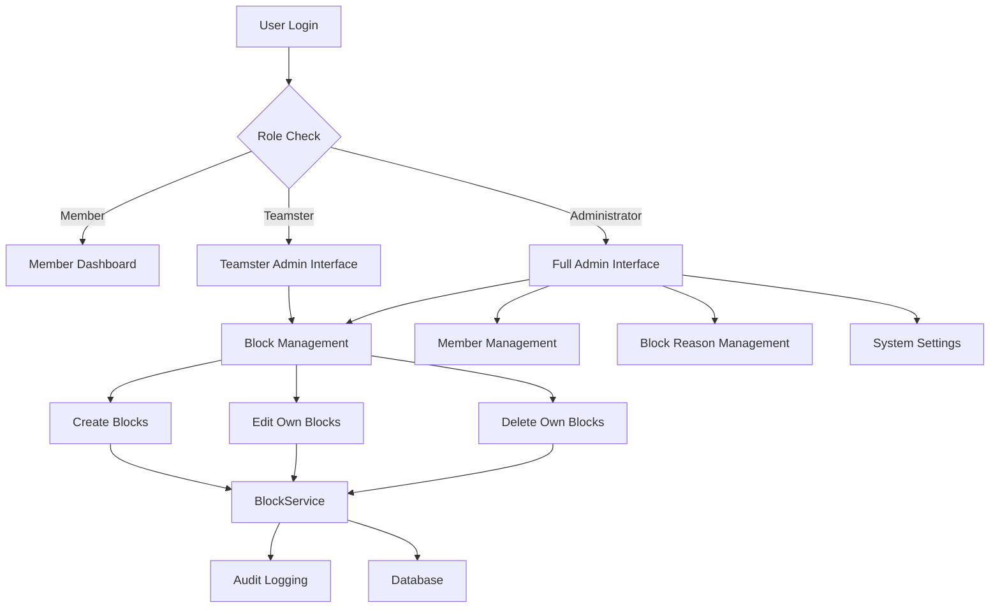

# Design Document

## Overview

This design implements a new "teamster" (Mannschaftsführer) role in the Tennis Club Reservation System, providing an intermediate permission level between regular members and administrators. The teamster role focuses specifically on court blocking capabilities for team management while maintaining strict access controls and audit trails.

The implementation follows a layered approach:
1. **Model Layer**: Extend the existing Member model to support the teamster role
2. **Authorization Layer**: Create new decorators and permission checks for teamster access
3. **Service Layer**: Modify BlockService to support teamster operations with ownership restrictions
4. **Route Layer**: Create teamster-specific routes and modify existing admin routes
5. **UI Layer**: Implement role-based interface customization

## Architecture

### Permission Hierarchy

The system implements a three-tier permission hierarchy:

```
Administrator (Full Access)
    ↓ (inherits all permissions)
Teamster (Block Management Only)
    ↓ (inherits basic permissions)
Member (Basic Reservations)
```

### Component Interaction



## Components and Interfaces

### 1. Member Model Extensions

**File**: `app/models.py`

Add new methods to the Member class:

```python
def is_teamster(self):
    """Check if the member has teamster role."""
    return self.role == 'teamster'

def can_manage_blocks(self):
    """Check if the member can manage blocks (teamster or admin)."""
    return self.role in ['teamster', 'administrator']

def can_edit_block(self, block):
    """Check if the member can edit a specific block."""
    if self.is_admin():
        return True
    if self.is_teamster():
        return block.created_by_id == self.id
    return False
```

### 2. Authorization Decorators

**File**: `app/decorators/auth.py`

New decorators for teamster access control:

```python
def teamster_required(f):
    """Decorator that requires teamster or admin role."""
    @wraps(f)
    def decorated_function(*args, **kwargs):
        if not current_user.is_authenticated:
            # Handle authentication error
        if not (current_user.is_teamster() or current_user.is_admin()):
            # Handle authorization error
        return f(*args, **kwargs)
    return decorated_function

def block_owner_or_admin_required(f):
    """Decorator that requires block ownership or admin role."""
    @wraps(f)
    def decorated_function(*args, **kwargs):
        block_id = kwargs.get('id') or kwargs.get('block_id')
        if block_id:
            block = Block.query.get_or_404(block_id)
            if not current_user.can_edit_block(block):
                # Handle authorization error
        return f(*args, **kwargs)
    return decorated_function
```

### 3. BlockService Enhancements

**File**: `app/services/block_service.py`

Add ownership filtering methods:

```python
@staticmethod
def get_blocks_for_user(user, date_range=None, court_ids=None, reason_ids=None):
    """Get blocks with user-specific filtering."""
    query = Block.query
    
    # Apply standard filters
    if date_range:
        start_date, end_date = date_range
        query = query.filter(Block.date >= start_date, Block.date <= end_date)
    if court_ids:
        query = query.filter(Block.court_id.in_(court_ids))
    if reason_ids:
        query = query.filter(Block.reason_id.in_(reason_ids))
    
    # Apply user-specific filters
    if user.is_admin():
        # Admins see all blocks
        pass
    elif user.is_teamster():
        # Teamsters see all blocks but with ownership info
        pass
    else:
        # Members see no blocks (shouldn't reach here)
        return []
    
    blocks = query.order_by(Block.date, Block.start_time).all()
    
    # Add ownership metadata for UI
    for block in blocks:
        block.can_edit = user.can_edit_block(block)
        block.can_delete = user.can_edit_block(block)
    
    return blocks

@staticmethod
def can_user_delete_batch(user, batch_id):
    """Check if user can delete a specific batch."""
    if user.is_admin():
        return True
    
    if user.is_teamster():
        # Check if all blocks in batch were created by this teamster
        blocks = Block.query.filter_by(batch_id=batch_id).all()
        return all(block.created_by_id == user.id for block in blocks)
    
    return False
```

### 4. Route Structure

**New File**: `app/routes/teamster/__init__.py`

Create a dedicated teamster blueprint:

```python
from flask import Blueprint

bp = Blueprint('teamster', __name__, url_prefix='/teamster')

from . import blocks
from . import views
```

**New File**: `app/routes/teamster/views.py`

Teamster-specific views:

```python
@bp.route('/')
@login_required
@teamster_required
def index():
    """Teamster dashboard - redirect to block management."""
    return redirect(url_for('teamster.blocks'))

@bp.route('/blocks')
@login_required
@teamster_required
def blocks():
    """Teamster block management interface."""
    return render_template('teamster/blocks.html')
```

**New File**: `app/routes/teamster/blocks.py`

Teamster block management routes (similar to admin routes but with ownership checks):

```python
@bp.route('/blocks', methods=['POST'])
@login_required
@teamster_required
def create_block():
    """Create a block as teamster."""
    # Similar to admin route but with teamster_id instead of admin_id
    
@bp.route('/blocks/<int:id>', methods=['PUT'])
@login_required
@teamster_required
@block_owner_or_admin_required
def update_block(id):
    """Update a block (only if owned by teamster)."""
    
@bp.route('/blocks/batch/<batch_id>', methods=['DELETE'])
@login_required
@teamster_required
def delete_batch(batch_id):
    """Delete a batch (only if all blocks owned by teamster)."""
    if not BlockService.can_user_delete_batch(current_user, batch_id):
        return jsonify({'error': 'Keine Berechtigung'}), 403
```

### 5. UI Template Structure

**New File**: `app/templates/teamster/base.html`

Base template for teamster interface:

```html



<nav class="teamster-nav">
    <a href="{{ url_for('teamster.blocks') }}">Platzsperren</a>
    <a href="{{ url_for('dashboard.index') }}">Zurück zum Dashboard</a>
</nav>

```

**New File**: `app/templates/teamster/blocks.html`

Teamster block management interface (similar to admin but with ownership indicators):

```html



<div class="block-management">
    <!-- Block creation form (same as admin) -->
    <!-- Block list with ownership indicators -->
    <div class="block-list">
        
        <div class="block-item {{ 'owned' if block.can_edit else 'readonly' }}">
            <!-- Block details -->
            
                <button class="edit-btn">Bearbeiten</button>
                <button class="delete-btn">Löschen</button>
            
        </div>
        
    </div>
</div>

```

## Data Models

### Member Model Changes

No database schema changes required. The existing `role` field already supports string values, so "teamster" can be added as a valid role value.

### Block Model Enhancements

Add virtual properties for UI support:

```python
class Block(db.Model):
    # ... existing fields ...
    
    @property
    def is_editable_by(self, user):
        """Check if block is editable by given user."""
        return user.can_edit_block(self)
    
    @property
    def created_by_role(self):
        """Get the role of the user who created this block."""
        return self.created_by.role if self.created_by else None
```

### Audit Log Enhancements

Extend BlockAuditLog to include role information:

```python
class BlockAuditLog(db.Model):
    # ... existing fields ...
    
    @property
    def admin_role(self):
        """Get the role of the admin who performed the action."""
        return self.admin.role if self.admin else None
```

## Correctness Properties

*A property is a characteristic or behavior that should hold true across all valid executions of a system-essentially, a formal statement about what the system should do. Properties serve as the bridge between human-readable specifications and machine-verifiable correctness guarantees.*

### Property 1: Role System Integrity
*For any* Member object, the role field should only contain valid values ("member", "teamster", "administrator"), and role-checking methods should return consistent results based on the role value.
**Validates: Requirements 1.1, 1.3**

### Property 2: Role Assignment Consistency
*For any* Member whose role is changed to "teamster", all existing relationships (reservations, favorites, notifications) should remain intact and accessible.
**Validates: Requirements 1.2, 1.4**

### Property 3: Authentication Uniformity
*For any* valid user credentials, the authentication process should work identically regardless of whether the user is a member, teamster, or administrator.
**Validates: Requirements 2.1**

### Property 4: Authorization Hierarchy
*For any* protected route, if a teamster can access it, then an administrator should also be able to access it, but a regular member should not.
**Validates: Requirements 2.3, 2.4, 2.5, 8.1, 8.2, 8.3**

### Property 5: Block Creation Ownership
*For any* block created by a teamster, the created_by_id field should be set to the teamster's ID, and the block should be editable by that teamster.
**Validates: Requirements 3.1, 4.3**

### Property 6: Batch Block Consistency
*For any* set of blocks created simultaneously by a teamster, all blocks should share the same batch_id and should all be owned by the same teamster.
**Validates: Requirements 3.2**

### Property 7: Conflict Resolution Parity
*For any* block created by a teamster that conflicts with existing reservations, the conflict resolution behavior should be identical to blocks created by administrators.
**Validates: Requirements 3.3**

### Property 8: Ownership-Based Edit Permissions
*For any* block and any teamster, the teamster should only be able to edit the block if they created it, while administrators should be able to edit any block.
**Validates: Requirements 4.1, 4.2**

### Property 9: Batch Deletion Ownership
*For any* batch deletion request by a teamster, the deletion should only succeed if all blocks in the batch were created by that teamster.
**Validates: Requirements 4.4**

### Property 10: Block Reason Access Consistency
*For any* teamster creating a block, they should have access to the same set of active block reasons as administrators, but should not be able to modify the block reasons themselves.
**Validates: Requirements 5.1, 5.3**

### Property 11: UI Element Visibility
*For any* teamster viewing the admin interface, only block management functionality should be visible, and edit buttons should only appear for blocks they own.
**Validates: Requirements 6.1, 6.2, 6.4**

### Property 12: Audit Trail Completeness
*For any* block operation performed by a teamster, an audit log entry should be created with the correct user ID and role information.
**Validates: Requirements 7.1, 7.2, 7.3, 7.4**

### Property 13: Permission Inheritance Consistency
*For any* teamster-protected resource, administrators should have access while regular members should be denied access.
**Validates: Requirements 8.2, 8.3**

### Property 14: Real-time Permission Updates
*For any* user whose role changes from member to teamster or vice versa, their access permissions should immediately reflect the new role without requiring re-authentication.
**Validates: Requirements 8.4**

## Error Handling

### Authentication Errors
- **401 Unauthorized**: User not logged in
- **403 Forbidden**: User lacks required role (member trying to access teamster routes)

### Authorization Errors
- **403 Forbidden**: Teamster trying to edit blocks they don't own
- **403 Forbidden**: Teamster trying to access block reason management

### Validation Errors
- **400 Bad Request**: Invalid role assignment (non-admin trying to change roles)
- **400 Bad Request**: Invalid block data (past dates, invalid times)

### Business Logic Errors
- **404 Not Found**: Block or batch not found
- **409 Conflict**: Attempting to delete batch with mixed ownership

## Testing Strategy

### Unit Tests
- Test role checking methods (`is_teamster()`, `can_manage_blocks()`, `can_edit_block()`)
- Test authorization decorators with different user roles
- Test BlockService ownership filtering methods
- Test UI template rendering with different user roles

### Property-Based Tests
Each correctness property will be implemented as a property-based test with minimum 100 iterations:

- **Property 1**: Generate random Member objects and verify role validation
- **Property 2**: Generate role changes and verify data integrity
- **Property 3**: Generate user credentials and verify authentication consistency
- **Property 4**: Generate route access attempts with different roles
- **Property 5**: Generate block creation scenarios and verify ownership
- **Property 6**: Generate multi-court block creation and verify batch consistency
- **Property 7**: Generate conflicting reservations and verify resolution behavior
- **Property 8**: Generate edit attempts and verify ownership restrictions
- **Property 9**: Generate batch deletion attempts and verify ownership checks
- **Property 10**: Generate block creation scenarios and verify reason access
- **Property 11**: Generate UI rendering scenarios and verify element visibility
- **Property 12**: Generate block operations and verify audit logging
- **Property 13**: Generate resource access attempts and verify inheritance
- **Property 14**: Generate role changes and verify immediate permission updates

### Integration Tests
- Test complete teamster workflow: login → create blocks → edit own blocks → delete own blocks
- Test admin override: admin editing teamster-created blocks
- Test UI integration: teamster interface showing correct blocks and permissions
- Test audit trail: complete operation history for mixed admin/teamster actions

### Test Configuration
- Use pytest for unit tests and property-based tests
- Use Hypothesis for property-based test generation
- Each property test tagged with: **Feature: teamster-role-management, Property N: [property description]**
- Minimum 100 iterations per property test to ensure comprehensive coverage